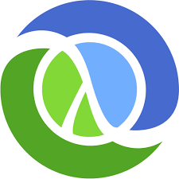
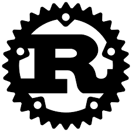

### Hi [Andres29AC][website] here 👋

  
   
  

  

       

  

## 💻 What I am currently doing:
- Actualmente estoy aprendiendo más sobre desarrollo web y en ocaciones tambien trabajo en las tecnologias de mi apartado Learming.
- Me interesa tambien todo lo relacionado con los datos:Cloud, Machine Learning and Data Science.
- La Seguridad Informatica me apasiona asi que tambien desarrollo herramientas sobre el tema pronto lo veran posteados en mi repositorio.
- ⚡ Dato curioso: me encantan los videojuegos pero no tengo mucho tiempo para jugar.

---
## 🚀 Coding
### Currently working on :

  

---
### Learming :

  

---
### Databases :

  

---
### Tools:

 

---

    

  
  

 
<b>Visitors Count</b>
  

 
 

****

<!--LINKS-->
[Website]: https://www.instagram.com/lion_coding29/
